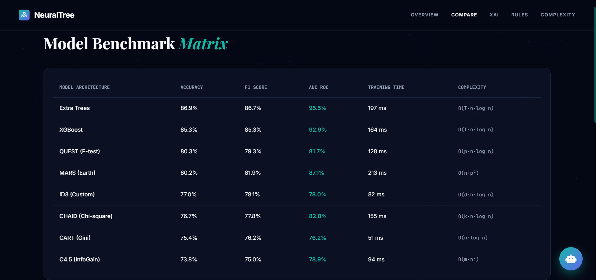

# 🌳 NeuralTree: Decision Intelligence Platform

**NeuralTree** is a professional-grade clinical decision support dashboard developed for Advanced Machine Learning (Assignment 02). It provides a high-performance, interactive environment to compare eight distinct decision tree architectures on the Heart Disease UCI dataset.


## 🚀 Key Features

- **8-Model Benchmarking Matrix**: Compare ID3, C4.5, CART, CHAID, MARS, QUEST, Extra Trees, and XGBoost in real-time.
- **Explainable AI (XAI)**: Integrated SHAP (SHapley Additive exPlanations) values to interpret global and local feature importance.
- **NeuralTree Assistant**: A smart, domain-aware chatbot powered by **Gemini 2.5 Flash** with **SSE Token Streaming** for zero-latency responses.
- **Boolean Rule Extraction**: Automatically extracts human-readable `IF-THEN` rules from complex tree structures.
- **Starry UI Engine**: A custom HTML5 Canvas constellation background that reacts to model selection.
- **Progressive Web App (PWA)**: Fully installable dashboard with offline caching capabilities.

## 🖼️ Screenshots

<p align="center">
  
  
  
  
  
  
</p>

## 🧠 Architectural Deep Dive

NeuralTree is architected as a decoupled analytical system to ensure high performance and separation of concerns.

1.  **Analytical Engine (`app.py`)**: 
    - Loads the Heart Disease UCI dataset and performs binary target transformations.
    - Orchestrates the training of 8 distinct architectures, including custom implementations for ID3/C4.5.
    - Computes **SHAP Kernel Explainer** values for global and local feature attribution.
    - Serializes the entire state (metrics, confusion matrices, ROC curves, and SHAP values) into a high-performance `results.json`.

2.  **Streaming Proxy (`server.py`)**:
    - Built using Python's `http.server` with a multi-threaded capable design.
    - Acts as a secure gateway for the **Gemini 2.5 Flash API**, preventing API key exposure in the frontend.
    - Implements **Server-Sent Events (SSE)** to stream AI tokens directly to the client with zero buffering.

3.  **Interactive Dashboard (`index.html`)**:
    - Consumes `results.json` and renders real-time comparisons using **Chart.js**.
    - Features a **Starry UI Engine** on an HTML5 Canvas, providing an immersive clinical aesthetic.
    - Uses a `ReadableStream` parser to handle token-by-token chatbot typing.

## 📊 Model Selection Rationale

We evaluated a spectrum of algorithms to observe the evolution of tree-based learning:
- **Foundational**: ID3 and C4.5 to observe entropy-based splitting.
- **Statistical**: CHAID (Chi-Square) and QUEST (ANOVA) to see how statistical significance affects tree growth.
- **Regression-Based**: MARS (Earth) to handle non-linear relationships via splines.
- **Ensembles**: Extra Trees and XGBoost to demonstrate the power of variance reduction and gradient boosting.

## 🔍 Explainable AI (XAI) Pipeline

NeuralTree solves the "Black Box" problem using two layers of transparency:
1.  **Global Interpretability**: A summary plot of SHAP values across the entire test set, identifying `thal` and `ca` as the most critical clinical indicators.
2.  **Local Interpretability**: Automated extraction of **Boolean Logical Rules** for single trees, allowing a clinician to follow the exact path taken for a specific prediction.

## 📦 Installation & Setup

1. **Clone the repository**:
   ```bash
   git clone <your-repo-url>
   cd AML_assignment_02
   ```

2. **Install Dependencies**:
   ```bash
   pip install scikit-learn xgboost shap numpy pandas python-dotenv
   ```

3. **Configure Environment**:
   Create a `.env` file in the root directory and add your Gemini API key:
   ```env
   GEMINI_API_KEY=your_actual_api_key_here
   ```

4. **Generate Results**:
   Run the analytical pipeline to train the models and generate metrics:
   ```bash
   python app.py
   ```

## 🏃 Running the Platform

1. **Start the Backend Proxy**:
   ```bash
   python server.py
   ```

2. **Access the Dashboard**:
   Open `http://localhost:8000`

## 📂 File Structure

- `app.py`: Analytical pipeline for model training and XAI calculation.
- `server.py`: SSE-enabled proxy server and static file host.
- `index.html`: Core dashboard UI and streaming logic.
- `report.tex`: Formal assignment report in LaTeX format.
- `results.json`: Benchmarking data consumed by the frontend.
- `sw.js`: PWA Service Worker for offline resilience.
- `.env`: API credentials (ignored by git).

---